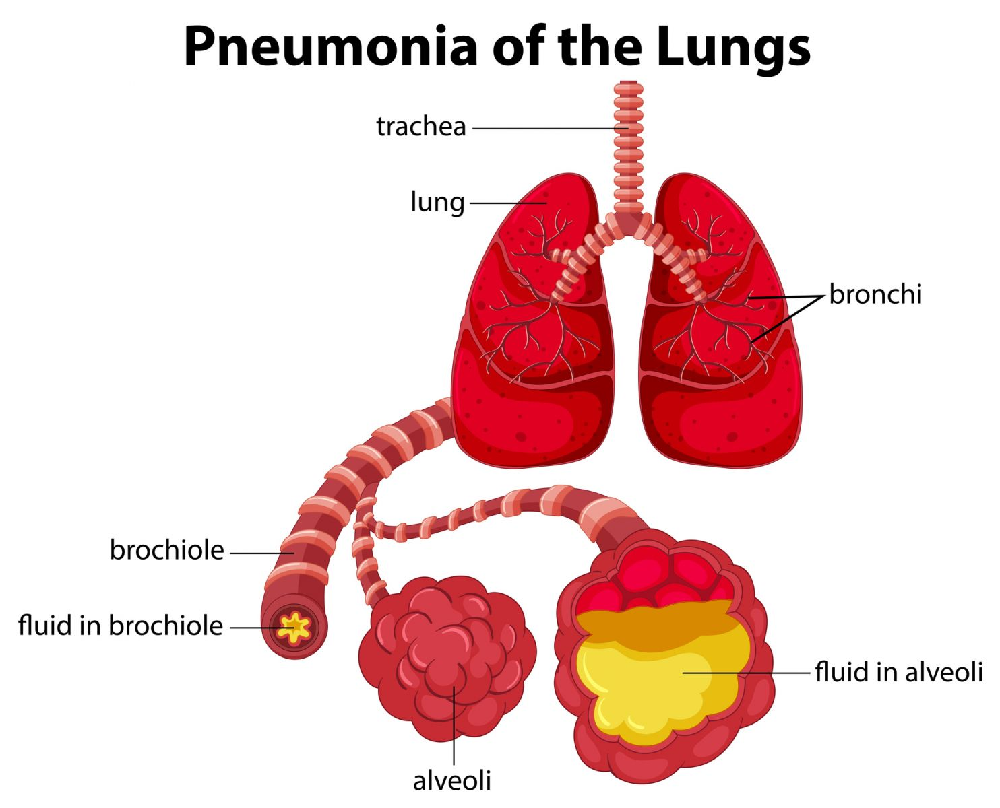

<h1 style="color:blue">Pneumonia Detection + Analysis</h1>

## Introduction



<p align="center">


</p>

Pneumonia is an inflammatory condition of the lung affecting primarily the small air sacs known as alveoli. Symptoms typically include some combination of productive or dry cough, chest pain, fever and difficulty breathing. The severity of the condition is variable.

Pneumonia is usually caused by infection with viruses or bacteria and less commonly by other microorganisms, certain medications or conditions such as autoimmune diseases. Risk factors include cystic fibrosis, chronic obstructive pulmonary disease (COPD), sickle cell disease, asthma, diabetes, heart failure, a history of smoking, a poor ability to cough (such as following a stroke), and a weak immune system. Diagnosis is often based on symptoms and physical examination. Chest X-rays, blood tests, and culture of the sputum may help confirm the diagnosis. The disease may be classified by where it was acquired, such as community- or hospital-acquired or healthcare-associated pneumonia.


**Deployed Web App: [Chest XRay Web Application](https://share.streamlit.io/heytanay/chest_xray_webapp/sharing/app.py)**

## Repository
This repository contains all the scripts needed to process chest xray data and train a model on it.

**Note: For the model to actually train, you have to specify the Pneumonia Chest XRay data directory (where you downloaded and extracted the data).**

*Download the data [here](https://www.kaggle.com/paultimothymooney/chest-xray-pneumonia/download).*

## Requirements

In order to run the scripts, you need to have the following packages installed on your machine:
- Numpy
- fastai

You can install them by issuing this command in your terminal:

```pip install numpy fastai```

If you are having problems in installing tensorflow, visit [this](https://www.youtube.com/watch?v=RgO8BBNGB8w).
For any others problems (including installation), you can open an Issue!

## Data Directory
The Data should be strictly in the following structure:

```
-IMG_DIR/
    | -train/
    |   | NORMAL/
    |   |   | -...
    |   | PNEUMONIA/
    |   |   | -...
    | -test/
    |   | NORMAL/
    |   |   | -...
    |   | PNEUMONIA/
    |   |   | -...
    | -val/
    |   | NORMAL/
    |   |   | -...
    |   | PNEUMONIA/
    |   |   | -...          
```

Make sure data is in the following structure before you pass the `img_dir` as a flag when running the `train.py` script.

## Training the Model
In order to train the model, you would have to issue following in your terminal (make sure you are in this repository).

`$ python train.py --dir IMG_DIR --epochs NB OF EPOCHS`

**Here `img_dir` is the directory as listed in last section and `epochs` is the number of epochs you want the model to train (default is 20).**

For example:

`$ python train.py --dir data/ --epochs 25`


Please star this repo, if you found it helpful!

## [NEW] Web App
The model has been deployed into a Streamlit-Powered Web Application. Currently, It only serves as an example but it can be extended to a full-fledged AI-powered medical application suite later.

